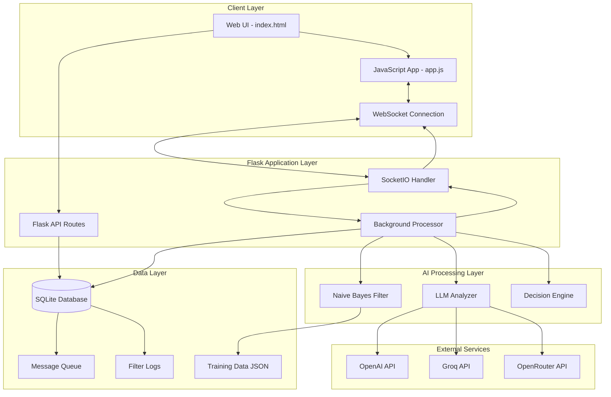
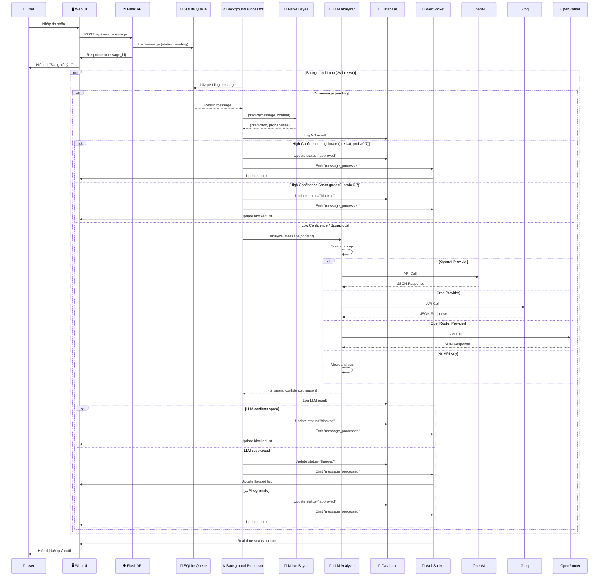
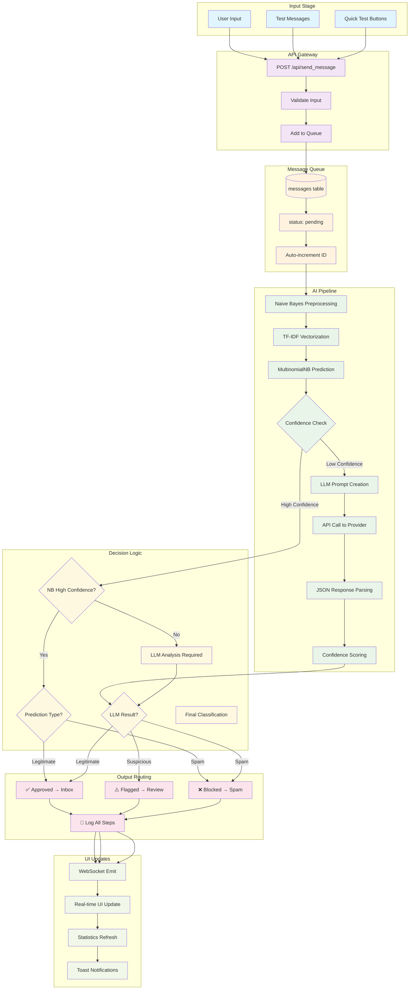
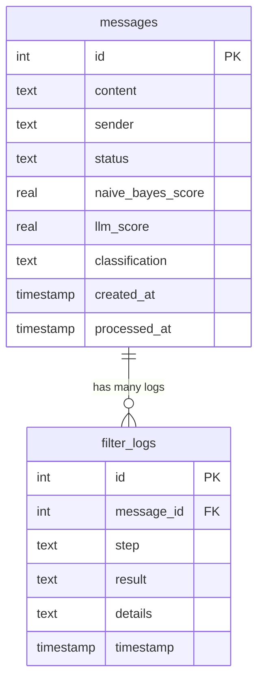
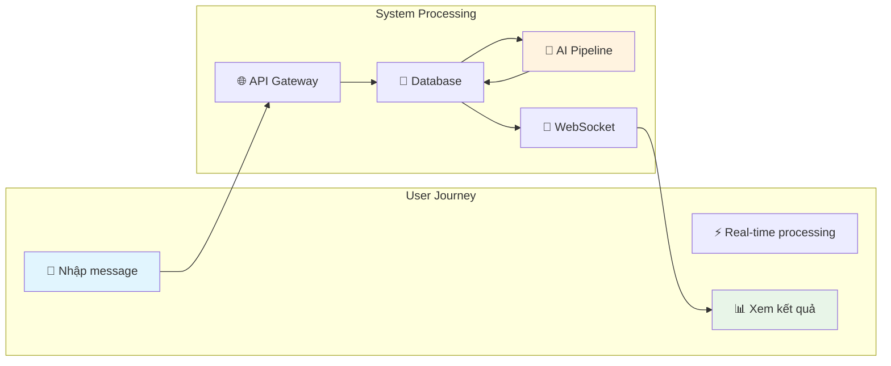

## 🔄 Mermaid Chart - Chi tiết luồng xử lý

### 1. Tổng quan kiến trúc hệ thống



### 2. Chi tiết luồng xử lý tin nhắn



### 3. Luồng dữ liệu chi tiết



### 4. Database Schema và Operations



---

## 📁 Chi tiết tác dụng từng file trong source code

### **1. 🚀 app.py - Flask Application Core**
```python
# Vai trò: Trung tâm điều phối toàn bộ hệ thống
```
**Chức năng chính:**
- **Flask App Setup**: Khởi tạo Flask server, SocketIO, cấu hình CORS
- **API Routes**: Xử lý HTTP requests (send_message, get_inbox, admin, stats)
- **WebSocket Events**: Real-time communication với client
- **Background Processor**: Thread xử lý message queue liên tục
- **Component Integration**: Kết nối Database, NaiveBayes, LLM Analyzer

**Flow xử lý:**
1. Nhận message từ API → Lưu queue (status: pending)
2. Background thread → Lấy pending messages
3. Chạy qua AI pipeline → Cập nhật status/classification
4. Emit WebSocket → Real-time update client
5. Cung cấp admin APIs → Xem logs, stats, export

---

### **2. ⚙️ config.py - Configuration Management**
```python
# Vai trò: Trung tâm cấu hình toàn hệ thống
```
**Chức năng:**
- **Environment Variables**: Đọc API keys từ môi trường
- **LLM Provider Config**: Chọn OpenAI/Groq/OpenRouter
- **Threshold Settings**: Ngưỡng confidence cho NB và LLM
- **Database Path**: Đường dẫn SQLite
- **Security**: Secret keys, CORS settings

**Ví dụ sử dụng:**
```python
Config.OPENAI_API_KEY        # API key
Config.NAIVE_BAYES_THRESHOLD # 0.7 (70% confidence)
Config.LLM_PROVIDER         # 'openai', 'groq', 'openrouter'
```

---

### **3. 💾 database/db_manager.py - Database Operations**
```python
# Vai trò: Data Access Layer cho SQLite
```
**Chức năng chính:**
- **Schema Management**: Tạo/quản lý bảng messages, filter_logs
- **Message Queue Operations**: 
  - `add_message()` → Thêm vào queue
  - `get_pending_messages()` → Lấy messages chưa xử lý
  - `update_message_status()` → Cập nhật kết quả xử lý
- **Logging System**: `log_filter_step()` → Ghi lại từng bước AI pipeline
- **Admin Queries**: Lấy data cho admin panel, inbox filtering

**Database Schema:**
```sql
messages: id, content, sender, status, scores, classification, timestamps
filter_logs: message_id, step, result, details, timestamp
```

---

### **4. 🧠 models/naive_bayes.py - Machine Learning Core**
```python
# Vai trò: AI Classification đầu tiên trong pipeline
```
**Chức năng chi tiết:**
- **Data Processing**:
  - `load_training_data()` → Đọc từ training_data.json
  - `preprocess_text()` → Chuẩn hoá text tiếng Việt
- **Model Training**:
  - TF-IDF Vectorization (1000 features, 1-2 grams)
  - MultinomialNB với alpha=1.0
  - Pickle serialization cho persistence
- **Prediction**:
  - `predict()` → Trả về (class, probabilities)
  - Classes: 0=legitimate, 1=suspicious, 2=spam
- **Performance**: Xử lý nhanh, làm bước lọc đầu tiên

**Pipeline:**
```
Text → Preprocessing → TF-IDF → Naive Bayes → (prediction, confidence)
```

---

### **5. 🤖 models/llm_analyzer.py - Advanced AI Analysis**
```python
# Vai trò: AI phân tích sâu cho trường hợp phức tạp
```
**Chức năng:**
- **Multi-Provider Support**:
  - `_analyze_with_openai()` → GPT-3.5-turbo
  - `_analyze_with_groq()` → Mixtral-8x7b
  - `_analyze_with_openrouter()` → WizardLM-2
- **Prompt Engineering**: Tạo prompt chuyên biệt cho spam detection tiếng Việt
- **Response Parsing**: Parse JSON từ LLM response
- **Fallback Mechanism**: Mock analysis khi không có API key
- **Error Handling**: Conservative approach khi có lỗi

**Output Format:**
```json
{
  "is_spam": true/false,
  "confidence": 0.0-1.0,
  "reason": "explanation in Vietnamese",
  "classification": "legitimate/suspicious/spam"
}
```

---

### **6. 📊 data/training_data.json - Training Dataset**
```json
// Vai trò: Dữ liệu huấn luyện cho Naive Bayes
```
**Cấu trúc:**
- **legitimate** (15 samples): Tin nhắn bình thường, công việc
- **suspicious** (15 samples): Tin nhắn nghi vấn, cần LLM phân tích
- **spam** (15 samples): Tin nhắn lừa đảo rõ ràng

**Đặc điểm:**
- Tiếng Việt native
- Phản ánh thực tế spam tại VN
- Balanced dataset cho 3 classes
- Từ khóa đặc trưng cho từng loại

---

### **7. 🖥️ static/index.html - User Interface Structure**
```html
<!-- Vai trò: Giao diện người dùng chính -->
```
**Components:**
- **Header**: Tiêu đề, connection status indicator
- **Chat Panel**: Form nhập message, quick test buttons
- **Results Panel**: 4 tabs (Inbox/Flagged/Blocked/Admin)
- **Stats Bar**: Real-time statistics
- **Toast Container**: Notifications

**Features:**
- Responsive design (Grid/Flexbox)
- Real-time updates via WebSocket
- Export functionality
- Admin panel với filter logs

---

### **8. 🎨 static/style.css - Visual Design**
```css
/* Vai trò: Styling và responsive design */
```
**Design System:**
- **Color Scheme**: Gradient background, clean white panels
- **Layout**: CSS Grid cho main content, Flexbox cho components
- **Animations**: Toast notifications, loading spinners, hover effects
- **Responsive**: Mobile-first approach
- **Components**: Buttons, forms, message cards, status indicators

**Key Features:**
- Glassmorphism design (backdrop-filter)
- Status-based color coding
- Smooth transitions
- Professional UX patterns

---

### **9. ⚡ static/app.js - Frontend Application Logic**
```javascript
// Vai trò: Client-side application controller
```
**Class Structure:**
- **SpamFilterApp**: Main application class
- **Socket Management**: WebSocket connection/events
- **UI Controllers**: Tab switching, form handling
- **Data Operations**: API calls, rendering, export
- **Real-time Updates**: Live message processing

**Key Methods:**
```javascript
sendMessage()           // Gửi message qua API
loadTabData()          // Load data cho từng tab  
renderMessages()       // Render message list
showToast()           // Hiển thị notifications
exportLogs()          // Export data to CSV
```

---

### **10. 🚀 run_demo.py - Setup & Initialization**
```python
# Vai trò: Bootstrap script cho demo
```
**Functions:**
- `check_requirements()` → Kiểm tra/cài đặt Python packages
- `create_directories()` → Tạo folder structure
- `create_training_data()` → Generate training dataset
- `setup_config()` → Hướng dẫn API key configuration

**Usage:**
```bash
python run_demo.py  # One-time setup
python app.py       # Run application
```

---

### **11. 📦 requirements.txt - Dependencies**
```txt
# Vai trò: Package management
```
**Core Dependencies:**
- `Flask` + `Flask-SocketIO`: Web framework + real-time
- `scikit-learn`: Machine learning (Naive Bayes, TF-IDF)
- `pandas` + `numpy`: Data processing
- `requests`: HTTP calls to LLM APIs

---

### **12. 📋 models/__init__.py & database/__init__.py**
```python
# Vai trò: Package initialization
```
- Module imports for clean project structure
- Expose public APIs
- Enable `from models import NaiveBayesFilter`

---

## 🔄 Interaction Flow Summary



**Tóm tắt luồng:**
1. **User Input** → Flask API → SQLite Queue
2. **Background Processor** → Naive Bayes → Decision Logic
3. **Low Confidence** → LLM Analysis → Final Classification  
4. **WebSocket** → Real-time UI Update → User sees result

Hệ thống được thiết kế modular, scalable và dễ maintain, với separation of concerns rõ ràng giữa các layers!
